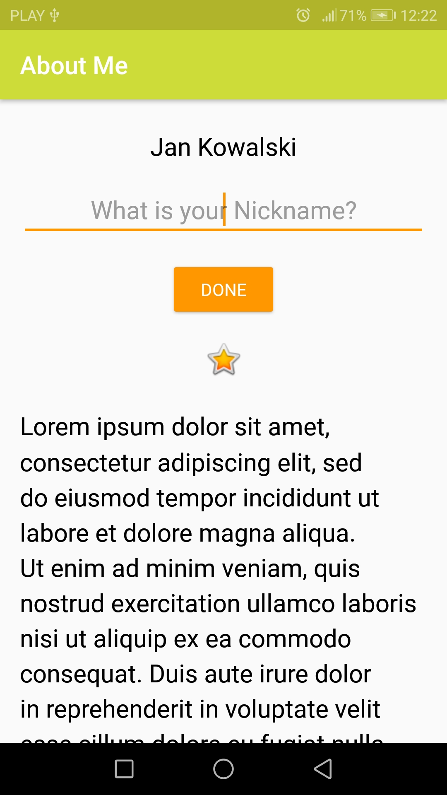
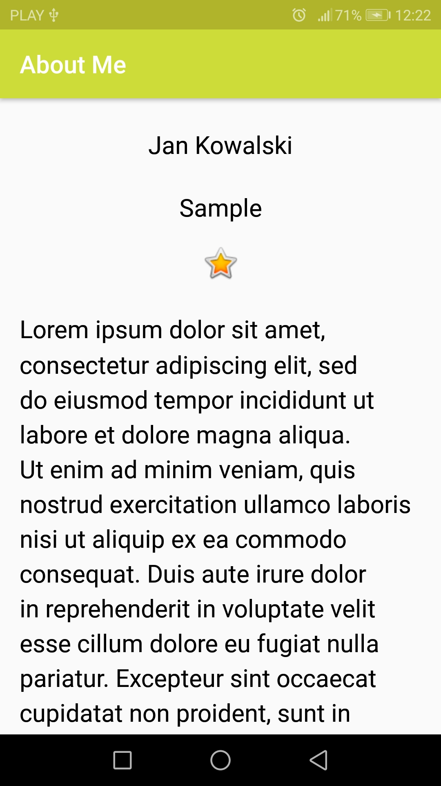

# AboutMe
> An Android application that is used to display the result of a DataBinding. The app covers the essentials of UI design such as TextView, EditText, ImageView, LinearLayout, ConstraintLayout, DataBinding.

## Table of contents
* [General info](#general-info)
* [Screenshots](#screenshots)
* [Technologies](#technologies)
* [Setup](#setup)
* [Status](#status)

## General info
The main goal of this project was to start writing Android code in Kotlin and learn how to deal with Android components using the core Kotlin features.

## Screenshots

## Technologies
* Kotlin - 1.3.70
* Android Studio

## Setup
* Clone or download ZIP repository https://github.com/Damian9696/Android_Kotlin_AboutMe
* Import the project into Android Studio

## Status
* Project is: _finished_. The project was not created for future updates

